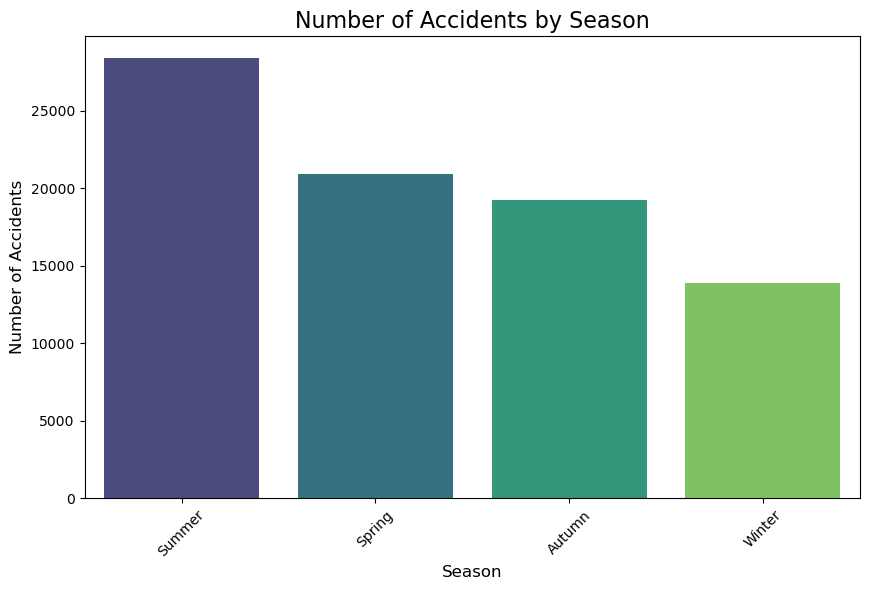
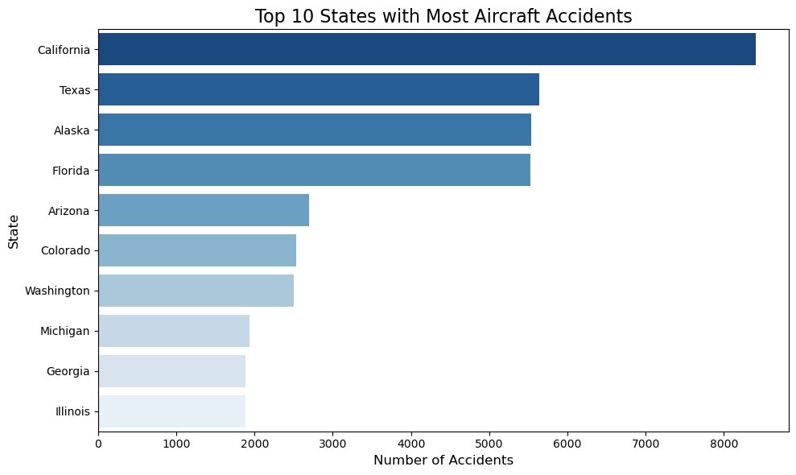

#
Aircraft analysis
Tableau link:
https://public.tableau.com/views/Aviation_analysis
## Aviation Business
With our company's recent interest in expanding and diversifying its portfolio in the aviation industry, I, Rodgers Ndemo, as the senior data analyst, analyzed aviation accident data from the National Transportation Safety Board, covering civil aviation accidents from 1948 to 2022. Through this project, I aim to provide actionable insights to guide the company in selecting the lowest-risk aircraft for both commercial and private enterprises. The objective is to minimize operational risks and enhance decision-making as the company ventures into the aviation sector by evaluating aircraft safety based on historical accident trends. Using data-driven analysis, I have identified aircraft makes and models with the lowest incidence of accidents or incidents, ultimately offering strategic recommendations for safe and informed aircraft acquisitions.

## Objectives
Main objective:  Giving recommendations on which aircrafts to purchase, based on the risk assessment.  
Other objectives:  
Identify the general trend on the number of aircraft accidents over the years.  
Identify the phases of flight where the aircrafts are most vulnerable to accidents.  
Analyze the states in US whereby the aircraft accidents are most frequent.  
Analyze the effects of weather conditions on the occurrence of accidents.  
Analyze the seasons during which the accidents are most rampant.

## Data understanding
The dataset contains 90,348 records with 31 columns, covering various aspects of aviation accidents, including:

Event Date: The date when the aviation accident or incident occurred.
Location: The geographic location where the incident took place.
Aircraft Make and Model: The manufacturer and specific model of the aircraft involved in the accident.
Aircraft Category: The type or category of the aircraft (e.g., commercial, private).
Aircraft Damage: Details about the severity of the aircraft damage (e.g., Destroyed, Substantial, Minor, Unknown).
Injury Severity: The injuries sustained (e.g., fatal, non-fatal, incident).
Weather Conditions: Information on the weather conditions at the time of the incident.
Probable Cause: The identified or suspected cause(s) of the accident.
Purpose of flight (e.g., personal, instructional, business)

## Plot showing number of accidents according to seasons

From the above, it is evident that a lot of accidents occur during summer.

## Plot showing states with highest number of accidents

From the above, it is evident that a lot of accidents occur in California and Texas.

